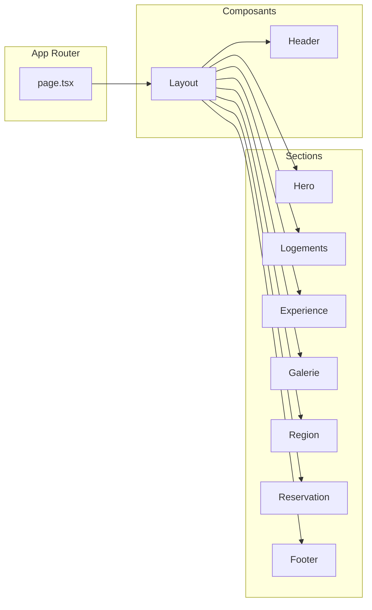

# Site vitrine premium – Deux gîtes Périgord Noir

## Données extraites et réécriture

### Logement 1 — « Les Glycines »

- **Nom (réécrit)** : _Les Glycines_ — Gîte de charme au cœur du Périgord Noir
- **Capacité** : 4 voyageurs · 2 chambres · 3 lits · 1 salle de bain (douche, WC)
- **Résumé** : Maison avec belle pièce à vivre, terrasse et jardin clos (salon de jardin, barbecue, hamac). Chambres rénovées en 2021. Piscine couverte partagée chauffée 10 m.
- **Équipements clés** : Jardin privé clôturé, terrasse, piscine (juin–sept), barbecue, cuisine équipée (lave-vaisselle, expresso), Wi‑Fi, TV, lits faits, linge fourni, lave-linge, lit bébé/chaise haute sur demande, animaux acceptés, arrivée autonome (boîte à clé), parking gratuit.

### Logement 2 — « La Maisonnette »

- **Nom (réécrit)** : _La Maisonnette_ — Maison en pierre, intimité et caractère
- **Capacité** : 4 voyageurs · 1 chambre mezzanine · 3 lits · 1 salle de bain (baignoire, WC)
- **Résumé** : Maison en pierre avec rez-de-chaussée (cuisine, salon/salle à manger) et mezzanine (lit double + 2 lits pliants). Jardin clos privatif, vue discrète sur la piscine.
- **Équipements clés** : Jardin privé clôturé, patio, piscine partagée, barbecue, hamac, cuisine équipée (lave-vaisselle 2023), Wi‑Fi, TV, linge fourni, lave-linge, lit bébé/chaise haute sur demande, animaux acceptés, abri voiture 1 place, ménage possible pendant le séjour.

**Localisation** : Saint-Martial-de-Nabirat, Dordogne (Périgord Noir). Coordonnées GPS : N44.75403 E1.24011.  
**Note** : La section « Découvrir la région » sera centrée sur le **Périgord Noir** (Sarlat, Domme, Beynac, La Roque-Gageac) et la Dordogne, avec éventuellement une carte « escapade » vers Cahors / Vallée du Lot pour élargir.

---

## Architecture technique

- **Stack** : Next.js 15 (App Router), React 19, TypeScript, Tailwind CSS.
- **Composants UI** : shadcn/ui (Button, Card, Input, Label, Textarea, etc.) + `lucide-react` pour les icônes.
- **Calendrier** : `react-day-picker` (v9) via le composant Calendar de shadcn/ui — plage de dates (date de début / date de fin) pour la demande de réservation.
- **Images** : dossiers sources `img-airbnb1/` et `img-airbnb2/` copiés ou symboliquement exposés sous `public/images/img-airbnb1/` et `public/images/img-airbnb2/` ; utilisation de `next/image` avec formats .avif, .webp, .jpg.
- **Structure** : Single Page avec ancres (Accueil, Nos Logements, La Région, Contact/Réserver) ou pages minimales si préféré — le cahier des charges privilégiant une navigation fluide, une **page unique avec sections et ancres** est adoptée par défaut.

---

## Étapes d’implémentation

### 1. Initialisation du projet Next.js

- Exécuter `npx create-next-app@latest . --typescript --tailwind --eslint --app --src-dir=false --import-alias "@/*"` à la racine du repo (ou dans un sous-dossier `site/` si vous souhaitez garder les fichiers actuels à la racine).
- **Choix à trancher** : créer l’app dans le repo actuel (à la racine, en déplaçant éventuellement `donnees-airbnb*.txt` et dossiers `img-*` dans un sous-dossier `content/` ou les laisser tels quels) ou dans un sous-dossier dédié.
- Installer : `lucide-react`, `react-day-picker`, `date-fns` (pour le calendrier), puis initialiser shadcn/ui (`npx shadcn@latest init`) et ajouter les composants : `button`, `card`, `input`, `label`, `textarea`, `calendar`, `select`.

### 2. Assets et données

- Copier ou lier `img-airbnb1/` et `img-airbnb2/` vers `public/images/img-airbnb1/` et `public/images/img-airbnb2/`.
- Créer un fichier de données (ex. `src/data/logements.ts` ou `src/lib/content.ts`) contenant pour chaque logement : nom, slug, description courte, capacité (voyageurs, chambres, lits, SDB), équipements, chemin de l’image d’accroche (une belle photo extérieure ou piscine par logement).
- Créer une liste d’images pour la galerie globale (mélange des deux dossiers, chemins relatifs à `public/images/`).

### 3. Layout de base et Header

- **Layout** : `src/app/layout.tsx` avec métadonnées (titre, description), police soignée (ex. Cormorant Garamond ou Playfair pour titres, Source Sans ou DM Sans pour le corps), palette épurée (blanc/crème, tons pierre/terracotta, vert doux).
- **Header** : fixe ou sticky, fond semi-transparent au scroll, menu : Accueil, Nos Logements, La Région, Contact/Réserver (ancres `#accueil`, `#nos-logements`, `#experience`, `#region`, `#reserver`). Bouton ou lien « Réserver » mis en avant. Mobile : menu hamburger.
- **Footer** : coordonnées (adresse, email, téléphone — à définir ou placeholder), lien vers carte Google Maps (embed ou lien vers N44.75403 E1.24011), emplacements pour réseaux sociaux.

### 4. Hero

- Grande image de fond (une des plus belles photos extérieures ou piscine depuis `img-airbnb1` ou `img-airbnb2`).
- Overlay léger pour lisibilité. Titre accrocheur type « Séjour d’exception en Périgord Noir » ou « Un domaine, deux gîtes de charme ».
- Sous-titre court et bouton « Découvrir nos logements » → ancre `#nos-logements`.

### 5. Section « Nos logements »

- Layout en grille ou zig-zag (alternance gauche/droite) pour Les Glycines et La Maisonnette.
- Pour chaque logement : image d’accroche (depuis le bon dossier), nom réécrit, résumé vendeur, capacité (voyageurs, chambres, lits, SDB), 4–6 équipements clés en icônes.
- Bouton « Plus de détails & Disponibilités » → ancre `#reserver`.

### 6. Section « L’expérience du domaine : partage & intimité »

- Bloc **Espaces communs** : piscine couverte chauffée 10 m, cour/espaces communs (ping-pong, balançoires, pétanque). Texte et images issues des dossiers (piscine, extérieurs).
- Bloc **Votre intimité** : chaque gîte a son jardin privé clôturé, sans vis-à-vis.
- Design aéré, images en pleine largeur ou en grille selon la maquette.

### 7. Galerie photo globale

- Grille type masonry (CSS `columns` ou librairie légère type `react-masonry-css`) avec images issues de `public/images/img-airbnb1` et `public/images/img-airbnb2`.
- `next/image` avec `sizes` adaptés et priorité pour les images above-the-fold.
- Option : lightbox au clic (composant simple ou librairie légère).

### 8. Section « Découvrir la région »

- Texte d’intro sur le Périgord Noir, Saint-Martial-de-Nabirat, proximité de Sarlat, Domme, Beynac, La Roque-Gageac.
- 3–4 cartes d’activités : ex. « Sarlat et marchés », « Châteaux de la Dordogne (Beynac, Castelnaud) », « Randonnées et nature », « Gastronomie périgourdine » (ou une carte « Escapade Cahors & Malbec »). Descriptions courtes et vendeuses.

### 9. Section demande de réservation

- **Calendrier** : `react-day-picker` (shadcn Calendar) en mode plage (date d’arrivée / date de départ) ; affichage statique, pas de synchronisation iCal.
- **Formulaire** : Nom complet, Email, Téléphone · Logement souhaité (select : Les Glycines / La Maisonnette) · Dates (remplies par le calendrier) · Nombre de voyageurs · Message (textarea).
- **Texte explicatif** : « Sélectionnez vos dates. Ce formulaire constitue une demande de réservation. Nous vous recontacterons par email pour confirmer la disponibilité, le tarif exact et vous transmettre notre RIB pour bloquer votre séjour par virement. »
- Soumission : pour l’instant, `action` du formulaire peut envoyer vers une API route qui envoie un email (ex. Resend, Nodemailer) ou enregistre en JSON ; si non configuré, désactiver l’envoi et afficher un message de confirmation côté client.

### 10. Footer

- Bloc coordonnées (adresse, email, tél).
- Carte Google Maps (iframe embed avec coordonnées N44.75403, E1.24011) ou lien « Voir sur la carte ».
- Liens réseaux sociaux (icônes avec href placeholder).

### 11. Responsive et polish

- Vérifier breakpoints (mobile, tablette, desktop) : menu, grilles, galerie, formulaire.
- Espacements généreux (padding/margin), typo hiérarchisée, contraste et accessibilité de base (focus, labels).

### 12. Commits

- Commit après : init Next.js · ajout shadcn + Header/Footer · Hero + Logements · Expérience + Galerie · Région · Réservation · Données + images · Polish responsive.

---

## Fichiers clés à créer

| Fichier                                 | Rôle                                      |
| --------------------------------------- | ----------------------------------------- |
| `src/app/layout.tsx`                    | Layout, métadonnées, polices              |
| `src/app/page.tsx`                      | Import et ordre des sections              |
| `src/components/Header.tsx`             | Navigation et ancres                      |
| `src/components/Hero.tsx`               | Bandeau d’accueil                         |
| `src/components/LogementsSection.tsx`   | Grille/zig-zag des 2 gîtes                |
| `src/components/ExperienceSection.tsx`  | Partage (piscine) + Intimité (jardins)    |
| `src/components/GallerySection.tsx`     | Masonry des photos                        |
| `src/components/RegionSection.tsx`      | Texte + cartes activités                  |
| `src/components/ReservationSection.tsx` | Calendrier + formulaire                   |
| `src/components/Footer.tsx`             | Coordonnées, carte, réseaux               |
| `src/data/logements.ts`                 | Données des 2 logements + textes réécrits |
| `src/data/gallery-images.ts`            | Liste des chemins d’images galerie        |
| `src/data/region.ts`                    | Textes et cartes « Découvrir la région »  |

---

## Point à clarifier

- **Emplacement du projet** : souhaitez-vous que le site Next.js soit généré **à la racine** du repo actuel (les fichiers `donnees-airbnb*.txt` et dossiers `img-airbnb1/`, `img-airbnb2/` restent à la racine ; le CLI créera `app/`, `components/`, etc. à côté), ou dans un **sous-dossier** (ex. `site/`) pour garder la racine dédiée aux contenus bruts ?
  - Par défaut, le plan suppose une création **à la racine** avec les assets images référencés depuis `public/images/` (copie ou lien des dossiers existants).
